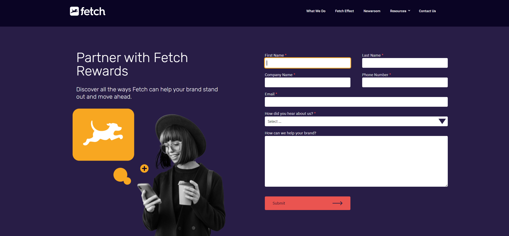
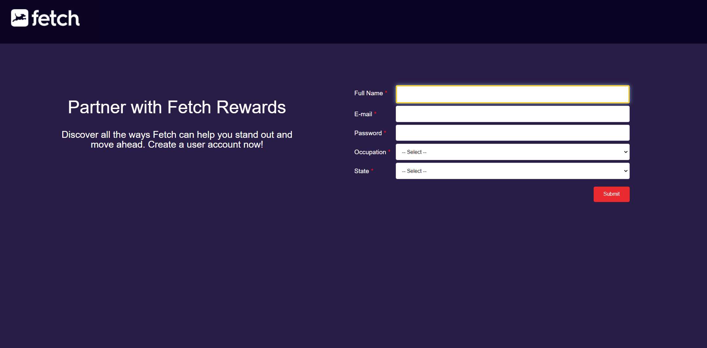

 <h1 align="center"> Fetch Rewards Take Home Code Exercise </h1> 

  

## Table of Contents
* [Introduction](#introduction)
* [Minimum Requirements](#minimum-requirements)
* [How Is This Exercise Evaluated?](#how-is-this-exercise-evaluated)
* [Built With](#built-with)
* [The Process: How I Completed It](#the-process-how-i-completed-it)
* [Room for Improvement](#room-for-improvement)
* [Acknowledgements](#acknowledgements)
* [Contact](#contact)
  

## Introduction
<table>
<tr>
<td>
This project is a take home code exercise given to candidates for their Frontend Engineer position. Your task is to build a webpage with a user creation form with the required inputs they give you. Some of those inputs should allow users to select from options returned by an endpoint. The endpoint url is given to you. The results should be submitted to the same endpoint with a JSON body format they show you that it should be in. I love take home assignments like this and accepted the challenge. I'll admit, I hadn't done any work utilizing JSON before, so I enjoyed learning how to utilize this technology to complete the assignment, which in turn allowed me to continue to build on my skillset. Fantastic!
</td>
</tr>
</table> 

## Minimum Requirements
The site must:
- Display a form with inputs for each field outlined (full name, email, password, occupation, state)
- Allow a user to complete and submit the form
- Do not allow form submission without completing the entire form
- Provide feedback upon successful form submission
  

## How Is This Exercise Evaluated?
You are evaluated on:
- Code quality
- Use of best practices
- Fulfillment of minimum requirements
- Site usability/UX

while providing any necessary documentation within the repository
  

## Built With
I built this webpage in VSCode utilizing:
- HTML
- CSS / Bootstrap
- JavaScript
- jQuery
- XMLHttpRequest (XHR)
- JSON
  

## The Process: How I Completed It
 First I started with a blank HTML template in VS Code. I then created a form and added the required inputs. This is where I started my javascript file to work with retrieving the JSON data from the endpoint they supplied. Even though they gave a snippet of the format the JSON body would return, I opened the endpoint url they gave me to see how the data looked. I copied it over to Notepad++ and formatted it using a JSON pretty-print plugin for better viewability. I then noticed that they listed occupation and states differently. The Occupations data was listed in an array with a list of the occupations they supplied, while the states were in an array of name value pairs by the state abbreviation and name. I don't think they did this to trick you or stump you, but to challenge you with working with different JSON data. Why else ask to populate a seperate dropdown if they are both formatted the same way? 

I used XMLHttpRequest to obtain the data and populate my dropdowns. Once I got that working I started on submitting the data captured in the form to return a response code of 201 if you send it in the correct format. There are several ways I could have handled submitting the form, but I went with input type="submit" over a button in the HTML and then I wanted to utilize jQuery's on submit function to bind the event to the form since I was using a form element. I also found I could use this for initial testing before actually trying to submit any data by printing my data out to the console to see it first, if I had it in the correct format. I did this by adding the preventDefault() method before acutally sending the request to view my results in the console.

After I got the form data captured in a JSON object and formatted correctly, I was able to POST the data and get the required 201 status code returned. Now that I had the functionality completed, I turned my attention to the other requirement of making sure all fields were completed before allowing form submission. I first thought about creating a function called first to run through each input to validate a value was there, but I actually like using the 'required' attribute on each input and select element. It looks cleaner to me when the fields aren't filled out seeing the built in browser validation for that attirbute than posting an alert box to the user. 

After that it was on to styling the site. I thought about several ways I wanted to style the page, but after doing a little research I decided to go to FetchRewards site and look around and see if they had a form on there I could review and get an idea of what they may be looking for. I navigated to their contact us page and found a form! I liked how clean their page looked and the color scheme, so I decided to try and mimick it. Here's how the 'contact us' page looked at that time:

    

I also noticed how they colored the focus on the input fields and incorporated that in to mine. I used their color for my submit button but decided to keep mine to the right of the form and with a more traditional style and size than they had. I ended it by popping an alert message if a status code of 201 was returned after submitting the form. I know alerts are mainly used with testing code, but it was something to alert the user if they submitted their information correctly and then I reset the form back after hitting ok.
  
Here is the final product that I came up with:

    

  

## Room for Improvement
Are there improvements that could be made with how I accomplished this? Of course there is, and I am looking forward to getting critiqued so that I can continue to learn and improve my skills. One area I want to get better at and continue to learn more about is designing a more responsive page.
  

## Acknowledgements
My girlfriend actually uses the fetch rewards app on her phone and loves it! She was just as excited when I told her about their Frontend Engineer position and that they had an office here in Birmingham. This take home exercise was really fun to complete; after all, this is my passion with Web development. Fetch Rewards looks like a fantastic company to work for and I'm excited about this great opportunity they have given me!
  

## Contact
Created by [@frankmullinax](https://www.linkedin.com/in/frankmullinax//) - feel free to add or contact me!

<!-- Optional -->
<!-- ## License -->
<!-- This project is open source and available under the [... License](). -->

<!-- You don't have to include all sections - just the one's relevant to your project -->
